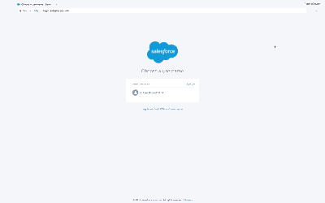
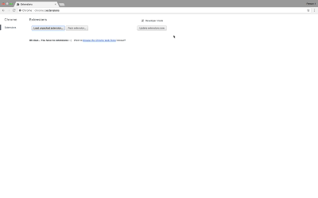

# get-sf-sessionid
Chrome Extension that gets Salesforce SessionId

### How it works:

### How to install:

This extension is not listed on the Chrome Extension store, for that reason you have to install it manually. To do so, follow these steps:

1. Clone this repo to your PC or download the source zip file
2. If you downloaded the zip file, extract it
3. From the Chrome Browser navigate to extensions
4. Enable developer mode (checkbox)
5. Click load unpackaged extension
6. Navigate to the repo you cloned or archive you extracted on your PC
7. Select the folder

